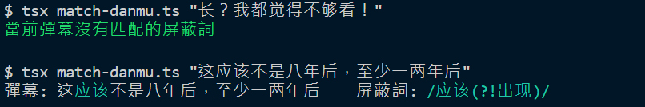

# BiliBili 查詢彈幕來源屏蔽詞小工具

用於優化屏蔽詞時使用的小工具，可以查詢被屏蔽的彈幕是因為哪條屏蔽詞而被屏蔽。

## 安裝

```bash
git clone https://github.com/wang48372162/bilibili-danmu-blocklist-match.git
cd bilibili-danmu-blocklist-match
yarn
```

然後到B站任意一個播放器的「屏蔽设定」內容區按右鍵「導出JSON文件」，並將下載的 bilibili.block.json 檔案放在該專案資料夾根目錄下。

## 使用方式

傳入需要查詢的彈幕文字：

```bash
yarn tsx match-danmu.ts <彈幕>
# 例：
yarn tsx match-danmu.ts "长？我都觉得不够看！"
```



## 錯誤訊息

### `SyntaxError: Invalid regular expression`

正則表達式的屏蔽詞有撰寫錯誤，修正後就可以正常使用。
